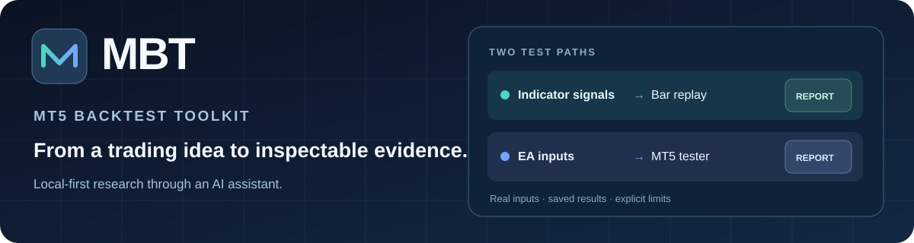

# MBT — MT5 Backtest Toolkit

<p align="center">
  
</p>

An **MCP server for researching MetaTrader 5 strategies with an AI assistant**.
MBT connects your assistant to MT5 price data and tester results, then turns
recorded evidence into reports you can inspect.

**Python 3.10+** · **MetaTrader 5** · **MCP-compatible AI client** · [MIT license](LICENSE)

[Get started](#install) · [Choose a workflow](#how-it-works) · [Explore the reports](#what-the-report-contains) · [Browse MCP tools](#tools-mcp) · [Compare with MT5](#mt5-directly-versus-mbt--an-ai-assistant)

| Indicator signals | Expert Advisors |
| --- | --- |
| Run an instrumented indicator in MT5, then replay **its logged signals** against broker price bars. | Compile and single-test an EA in MT5, inspect inputs, and run bounded complete or genetic optimization. |
| Inspect entries, exits and ambiguous bars in an HTML report. | Freeze candidates, check later dates, inspect trades on a chart, and optionally resample verified closed trades. |

These are different test paths: indicator replay does **not** optimize indicator
inputs or execute an EA. EA optimization uses MT5's native tester; MBT does not
replace it. Neither path proves future profitability.

---

## Why MBT uses real indicator signals

Reimplementing an MQL5 indicator in Python can introduce different behavior—or
repeat the same bugs. MBT instead reads the indicator's own logged signals,
including entry, stop-loss, take-profit and optional context, then replays them
against broker price bars.

This tests the logged trading signals without duplicating the indicator's logic.
It does not prove that the indicator calculates correctly or that its signals
are free from repainting or look-ahead bias. Bar-level replay also depends on
the configured rule for bars that touch both stop and target.

---

## How it works

**For indicator signals:** add `SignalLogger.mqh`, let the indicator write
`signals.csv`, then ask MBT to replay those entries against MT5 bars. MBT reports
whether the logged stop or target was reached under the chosen bar rules.

**For Expert Advisors:** MBT asks MT5 to compile or test the actual EA. It can
orchestrate native input optimization, freeze an in-sample selection, and run
separate later-period checks. Limited Monte Carlo uses verified saved trades;
it does not rerun the EA or model its future signals. See [Use it](#use-it)
for the individual workflows.

---

## Install

> **New to this?** Paste the MBT repo URL into Claude Code and say:
> `"Clone this repo and set up the MBT MCP server for me"`
> Your assistant can help clone the repository, run the installer and register
> the server. Review `config.yaml` for your terminal before running a test.

```bash
cd MBT
python install.py
```

This installs dependencies, creates `config.yaml`, copies `SignalLogger.mqh`
into your MT5 `Include` folder and the headless host EA `MBT_IndicatorHost.mq5`
into `Experts`, and prints the command to register the MCP server with Claude Code.

Then edit **config.yaml**:

```yaml
mt5_path: "C:/.../terminal64.exe"   # the terminal your indicator runs on
signal_file: "signals.csv"           # must match SignalLogFile in your indicator
default_symbol: "EURUSD"
default_timeframe: "1h"
ambiguous_bar: "loss"                # conservative
```

> Running an indicator headlessly or testing an EA also needs the **`tester:`**
> block (terminal path, etc.) — copy it from `config.example.yaml` and fill it in.
> The plain indicator-replay backtest doesn't require it.

Native input inspection/optimization additionally needs the EA's adjacent `.mq5`
source and an up-to-date compiled `.ex5`. Supported included source files must
be available inside MQL5. Close the terminal before MBT-controlled tester runs;
MBT refuses a busy terminal instead of taking it over. Restart the MCP connection
after updating MBT so the client discovers the new tools.

Register the server (printed by the installer):

```bash
claude mcp add mbt python "/abs/path/to/MBT/mcp_server.py"
```

**Using Claude Desktop instead of Claude Code?** Open
**Settings → Developer → Edit Config** (this opens `claude_desktop_config.json`)
and add:

```json
{
  "mcpServers": {
    "mbt": {
      "command": "python",
      "args": ["/abs/path/to/MBT/mcp_server.py"]
    }
  }
}
```

Restart Claude Desktop to load it.

---

## Running on Linux / macOS (via Wine)

MetaTrader 5 and its Python package are Windows applications. The existing
indicator/tester tooling includes a [Wine](https://www.winehq.org/) setup path.
Native optimization, custom commissions and equity recording have been tested
on Windows; these features have not been validated under Wine. Monte Carlo
analyzes saved reports in Python without launching MT5.

**The one rule:** the `MetaTrader5` Python package talks to the terminal through a
Windows DLL, so it must run under the **same Wine prefix's Python** as MT5 — not
your system Python. A native Linux/macOS Python process cannot use the Windows
`MetaTrader5` package to connect to the terminal.

> This rule is only for the **replay engine** (`backtest`, `get_ohlcv`,
> `get_signals` — they read live data via the `MetaTrader5` package). The
> tester-based tools (`run_indicator`, `run_strategy_tester`, `compile_ea`) don't
> use that package at all — they launch the terminal/MetaEditor directly. On
> Linux/macOS they just need `launcher: "wine"` in the `tester:` block (the
> installer defaults it for you). They can launch through Wine from system Python;
> compatibility depends on your Wine and terminal setup.

1. **Install MT5 under Wine** — download the installer from your broker (or
   MetaQuotes) and run it with Wine. It lands in a Wine prefix, e.g.
   `~/.wine/drive_c/Program Files/MetaTrader 5/terminal64.exe`.

2. **Install a Windows Python *into the same Wine prefix*** and add the deps:

   ```bash
   wine /path/to/wine/python.exe -m pip install MetaTrader5 numpy PyYAML mcp
   ```

3. **Point `config.yaml` at the Wine paths.** Use the Windows-style terminal path,
   and a `Z:`-mapped absolute path for the signal file (Wine maps `Z:` to `/`):

   ```yaml
   mt5_path: "C:/Program Files/MetaTrader 5/terminal64.exe"
   signal_file: "Z:/home/you/path/to/signals.csv"
   ```

4. **Run everything through the Wine Python**, not system Python:

   ```bash
   wine /path/to/wine/python.exe mcp_server.py        # the MCP server
   wine /path/to/wine/python.exe run_report.py        # a one-off backtest
   ```

> **Tip:** `SignalLogger.mqh` lives inside the Wine prefix's
> `MQL5/Include` folder — copy it there manually if `install.py` can't find it.
> The existing Python replay core and indicator HTML report need no strategy
> rewrite. Native optimization, custom commissions and equity recording remain
> unvalidated under Wine.

---

## Add logging to your indicator

```mql5
#include <SignalLogger.mqh>

// In OnInit (or on full recalculation) so the log matches the chart:
ResetSignalLog();

// When your buy/sell condition is true on bar `shift`:
LogSignal(shift, true,  entry, sl, tp, "TRENDING");  // BUY
LogSignal(shift, false, entry, sl, tp, "TRENDING");  // SELL
```

`regime` is optional — pass `""` if you don't use it. When present, the backtest
report breaks results down per regime.

Compile it — that's all. From here you have two ways to make the indicator log
its signals:

- **Headless (recommended):** ask Claude to run it — `run_indicator` computes the
  indicator over your chosen date range with no chart and writes the signals
  automatically. Nothing to attach.
- **On a chart:** attach the compiled indicator to a chart as usual; it writes
  `signals.csv` live as it runs.

Either way you end up with the same signal file, which the `backtest` tool reads.

---

## Use it

Describe what you want in your MCP-compatible AI client. The assistant can use
MBT's tools to inspect the available settings and run the requested workflow.

**Run your indicator and backtest it — no chart needed:**

> "run my MyIndicator indicator on XAUUSD H1 for the last 3 years, then backtest it"

The assistant runs the indicator headlessly in MT5, where it computes and logs
its own signals, then replays those signals on broker bars and returns the
metrics and an HTML report without attaching the indicator to a chart.
The indicator must first be installed, compiled and configured for logging.

**Or backtest signals you already have** (from a previous run, or an indicator
running live on a chart):

> "backtest my signals"
> "backtest signals since 2026-01-01 and give me the HTML report"
> "validate my signal file"
> "fetch the last 300 EURUSD 1h bars"

The `backtest` tool returns full metrics and writes an HTML report (with a
cumulative-R curve) to `reports/`. This is a signal-replay report, distinct from
the native-EA experiment report described below.

### Build, test & verify an Expert Advisor

Once you have an EA (or ask Claude to build one from your indicator), MBT lets
you compile it, run it through MT5's real tester, and compare its logged signals
with your indicator's signals:

**Step 1 — compile and fix:**
> "check my EA for errors"
> "fix the errors and compile again"

MBT compiles with MetaEditor and returns structured errors and warnings. Your
assistant can use these diagnostics to help fix the code and compile it again.

**Step 2 — backtest the real EA code:**
> "run a strategy tester backtest of my EA on XAUUSD H1 from 2018 to now"

This runs MT5's own headless Strategy Tester using its configured price,
spread, swap and execution models—not a Python reimplementation of the EA.
MBT returns metrics from the native Strategy Tester report.

Single EA backtests also generate an MBT HTML report automatically, with test
settings, inputs, statistics, balance/drawdown charts and recorded deal history.
It has no optimization rankings or in-sample/out-of-sample sections.

To inspect recorded deals on a price chart, ask: "Open this backtest's trades
in MT5." `open_backtest_chart` accepts the native report path, or an optimization
run ID with a candidate pass and `in_sample`/`holdout` period. Optimization
summary rows alone cannot supply trade markers; a detailed backtest is required.

Reports also include **Open trades in MT5** buttons. Ask the assistant to run
`start_mt5_chart_launcher`, then refresh the report before clicking. This opt-in
localhost launcher expires after 30 minutes and accepts token-protected requests
for saved MBT reports only. Your browser may ask permission for local-network
access. `stop_mt5_chart_launcher` stops the bridge without closing MT5.

Close MT5 before either method. MBT opens a non-trading display script, disables
automated trading for that launch and leaves the terminal open. It plots up to
5,000 saved buy/sell deal markers, with tooltips showing entry/exit direction,
time, price and volume. It does not infer trade-connecting lines, rerun the EA,
attach its indicators or provide animated tester playback. Chart candles come
from your terminal's broker history and need not exactly match the original
tester feed. Multi-symbol histories require separate charts and are not supported
by this single-chart tool. Close the display terminal before further MBT tests.

For execution-delay sensitivity, `run_strategy_tester` accepts
`execution_delay_ms=0` (no delay, default), a fixed value from 1 to 600000 ms,
or `-1` for MT5's native random delay. For example: "Repeat this single EA
backtest with a fixed 100 ms execution delay; keep the other settings unchanged."
The report displays the delay from the tester configuration. Random-delay runs
may differ between repetitions; math-calculation mode does not support delays.
This tests execution sensitivity, not every form of broker or market stress.

Hover over charts to inspect recorded timestamps and values. Optimization charts
show pass metrics and parameters; Monte Carlo charts show synthetic trade counts,
percentiles or histogram ranges, not calendar dates. Long time-series charts may
display a reduced set of recorded observations; tooltips identify the nearest
displayed observation rather than interpolating a result between trades.

**Step 3 — cross-check EA results against your indicator:**
> "compare my EA's results with my indicator backtest — do they match?"

With comparable signal logs from the EA and indicator, `signal_parity` compares
their recorded decisions and reports the first divergence. This helps identify
differences when porting an indicator strategy to an EA.

### Inspect and fine-tune an EA

Start with the inputs the EA actually exposes:

> "Inspect my EA and show its settings, defaults and available method choices."
> "Compare SMA and EMA with periods 10, 20 and 30; keep the other settings fixed."

`inspect_ea_inputs` reads supported source declarations and included files.
It returns numeric/string/boolean inputs, named dropdown choices, groups and
fixed-only (`sinput`) flags. Available methods and other choices depend on the
inputs exposed by the EA. `import_ea_parameters` can load a native SET file from the configured
Tester profile, validating values and ranges against the source.

Use `optimize_ea` for a complete grid or genetic search. The AI supplies every
input as `{type,value}`, adding `{start,step,stop}` to swept inputs. For example,
`MovingPeriod={"type":"int","value":20,"start":10,"step":10,"stop":30}`
tests three periods. Boolean sweeps and supported local/built-in enums work;
strings and fixed-only inputs cannot sweep. Source-derived enum labels are
retained in reports. Opaque compiled-only EAs, unresolved conditional/macro-generated
inputs, unsupported types/expressions and runtime range overrides fail closed.

Source/include hashes are frozen for replays and market-batch continuation;
dependencies newer than the EX5 require recompilation. Source adjacency and
timestamps are not cryptographic proof that the binary was compiled from that source.
Planned combinations, actual saved rows and MT5 log counts remain separate.
Genetic search may skip combinations or fall back to complete search on a small grid;
MBT reports the saved results and execution counts separately from the total
parameter search space.

Choose the MT5 optimization criterion before running. `optimize_ea` and
`optimize_ea_holdout` accept these MBT request values:

| MT5 criterion | MBT `criterion` value |
| --- | --- |
| Balance max | `balance` |
| Profit Factor max | `balance_profitability` |
| Expected Payoff max | `balance_expected_payoff` |
| Drawdown min | `balance_drawdown` |
| Recovery Factor max | `balance_recovery` |
| Sharpe Ratio max | `balance_sharpe` |
| Custom max | `custom` |
| Complex Criterion max | `complex` |

The `balance_*` strings are MBT's request names; the actual scores come from MT5's
saved `Result` column. Complete search tests the full grid and uses that score to
rank passes; genetic search also uses it to guide the search. `custom` requires an
EA with an `OnTester()` score. MBT keeps only passes meeting `min_trades` when it
selects an in-sample winner or holdout shortlist. Check profit, trade count and
later-period results alongside the chosen criterion. In a local MT5 qualification,
Drawdown min scored negative equity drawdown percentage; balance drawdown was
different. Inspect the reported metric when comparing runs from another terminal.

### Separate parameter selection from out-of-sample checks

> "Optimize on the earlier dates, freeze the candidates, then test them on the later dates."

`optimize_ea_holdout` requires an explicit cutoff. It ranks distinct eligible
candidates using **in-sample** results only, then runs separate native single
tests on both the earlier and later periods. The original winner stays selected,
even if another candidate looks better out of sample. Completed candidate tests
provide detailed reports, not just optimization-summary charts; pending and
failed periods remain clearly marked.

Default shortlist sizing follows MT5's proportions: 10% for complete search or
25% for genetic search, minimum 256 where available, all eligible candidates
when fewer exist. Percentages round upward after the minimum-trades filter and
deduplication; exact native subset identity is not asserted. `holdout_top_n` is
an explicit override for the shortlist size.

Tests are sequential. `holdout_budget_sec=600` is shared; each single test has
`holdout_timeout_sec=120`, also bounded by `timeout_sec`. A batch pauses before
launching a test whose full allowance no longer fits. `continue_holdout_tests`
resumes unrun periods without re-optimizing or replacing completed evidence.
Failed tests are distinguished from unrun ones and are not retried implicitly.

This is **independent holdout**, not MT5's native Forward Results subset. Native
forward XML exports may be missing on some terminal setups. MBT marks those
runs as unverified rather than treating them as successful forward checks.
`recover_forward_report` can validate a manually exported native forward file.
Revising a strategy after viewing holdout results requires a fresh untouched final
period; MBT cannot determine whether those dates were already inspected outside
its workflow.

### Account settings, costs and multiple markets

> "Use a 5,000 USD account, 1:30 leverage and a fixed 100 ms execution delay."
> "Compare EURUSD and GBPUSD using the same settings, with a separate winner per market."

Pass `testing={"deposit":5000,"currency":"USD","leverage":30,"execution_delay_ms":100}`
to optimization/holdout. Settings propagate to detailed replays. Delay accepts
0, fixed 1..600000 ms, or -1 for random delay. Random delay is allowed for standalone
optimization but excluded from paired tests requiring exact in-sample reproduction.

Optional `testing.commission` configures **native**, instant per-lot commissions:

```json
{
  "per_lot": 3.5,
  "entry": "both",
  "profile_name": "<actual native group filename>.txt",
  "template_path": "C:/path/to/MBT/native-tester-export.txt"
}
```

The rate is in deposit currency **per charged side**: 3.5 on both sides means
7 per lot round trip. Choose `both`, `in` or `out`. Use your terminal's actual
server/account-mode filename and a native settings export inside MBT, not another
broker's margin settings. MBT freezes the template, preserves its account fields,
verifies profile application and checks actual detailed-report deal fees.
Original profiles and exact-prefix optimization caches are preserved/restored;
new caches are retained as run evidence. Price history and `.tst` caches are untouched.
Interrupted recovery blocks further launches until `restore_tester_commissions`
can safely restore the journalled state with MT5 closed. Cache isolation requires
same-filesystem renames and is bounded to 128 files/512 MiB with streaming hashing.

The fee contract is two-decimal cash reports, ordinary single-symbol entry/exit
deals, and fixed instant per-lot fees—not tiered/percentage/daily/monthly/minimum
fees or reversal/Close By histories. Zero-trade reports state that no fee events
were available. Custom commissions require native `forward_mode="off"`; use
independent holdout for paired out-of-sample checks.

`optimize_ea_symbols` runs up to 20 explicit symbols sequentially, with an HTML
comparison report and individual experiment links. Add `cutoff_date` to its
settings for paired holdout. `continue_symbol_optimization` resumes unfinished
markets/candidates. Winners are selected independently per market; this is not a
pooled portfolio or an all-Market-Watch scanner. Scheduling budgets do not impose
CPU/RAM ceilings; native local optimizer agents can still use available cores.

### Monte Carlo from verified trades

> "Shuffle the winner's out-of-sample trades 1,000 times, seed 42, and update the HTML."
> "Also bootstrap those trades to compare sampled profit and drawdown outcomes."

`run_monte_carlo` reads a frozen candidate's verified detailed report. The default
is the original in-sample winner's **holdout** period; choose `period="in_sample"`
explicitly for training-history diagnostics. Periods are never pooled or silently
substituted. It launches no MT5 tests and changes no strategy selection.

Each call returns a saved `analysis_id`. Use `get_monte_carlo_results(run_id,analysis_id)`
to inspect its verified statistics, chart data and assumptions in a later session
without rerunning it; `get_optimization_results` lists the run's analysis IDs.

| Method | What changes | What does not change |
| --- | --- | --- |
| `shuffle` | Order of whole closed trades; balance path and drawdown | Same trades/sizes/costs, so final net profit stays constant |
| `bootstrap` | Trades sampled with replacement; repetitions/omissions, terminal profit and drawdown | Historical recorded cash sizes/costs and number of sampled trades |

Entry fees and partial-exit cash events remain attached to their trade block.
At least five fully closed trades are required; small samples are prominently
flagged. Only unambiguous one-at-a-time single-symbol histories are supported;
overlapping/scale-in/reversal/Close By/open trades or account transfers are rejected.
Every deal's cash/costs must reconcile with balance and detailed-report totals.

Default: 1,000 paths, seed 42. Limits: 100..5,000 paths and at most 2 million
simulated deal events; lower the path count for longer histories. Execution uses
one local Python process, no MT5/GPU/cloud/worker pool, and retains bounded
statistics—not every simulated path. Saved source/analysis hashes are verified
again before the report displays charts.

These are **fixed recorded-cash diagnostics**, not reruns of percentage-risk or
loss-responsive money management. They assume exchangeable trades and do not
preserve market regimes/serial dependence. Synthetic balance bands are pointwise
percentiles, not historical equity or future confidence limits. Resampling does
not remove optimization bias, predict future profitability, or replace genuine
out-of-sample/other robustness checks. A zero-crossing fraction is not a modeled
broker-stopout probability.

### Optional measured equity

`capture_candidate_equity(run_id,pass_id=null,period="both",timeout_sec=120)`
records genuine balance/equity observations for one frozen candidate. It creates
a recorder EA copy without changing the original, then accepts the observations
only when replay totals and chronological deal balances match the detailed report.
Verified captures are reused; failed captures leave the original evidence intact.

The recorder supports fewer source shapes than input inspection: custom-included
EAs may optimize normally but cannot currently use that adapter. Open-price
sampling is sparse, not intrabar-equity proof. Both periods cost up to two
additional sequential tests; the timeout applies separately to each compile and
test (up to four allowances plus overhead), not a shared wall-time budget.

### Setup for the headless run & EA tools

The prompts above use the following setup. Your AI assistant can help configure
it, but the terminal paths and installed indicators/EAs must match your machine.

- **`tester:` block** — both the headless `run_indicator` and the EA tools
  (`compile_ea`, `run_strategy_tester`, input inspection and optimization) need it filled in; copy it
  from `config.example.yaml`. The plain indicator-replay `backtest` does not.
- **Host EA** — `run_indicator` loads your indicator through a bundled helper EA,
  `MBT_IndicatorHost.mq5`. `install.py` copies it into `MQL5/Experts`; it must be
  compiled once (just ask Claude to "compile the MBT indicator host").
- **Indicator logging** — the indicator must log via `SignalLogger.mqh` (a custom
  logger that writes only to the terminal's local `Files` folder isn't visible to
  the headless runner). Headless runs use the indicator's **default** inputs.
- **Linux/macOS** — these tools launch the terminal directly through Wine; set
  `launcher: "wine"` (the installer defaults it) and `portable: true` if the install
  keeps its data beside the exe.

---

## What the report contains

### Indicator signal-replay report

- Total trades · wins · losses · open
- Win rate · profit factor · expectancy (avg R)
- Net result · max drawdown (in R)
- Average win / loss · max win/loss streaks
- Per-regime breakdown
- Equity curve (cumulative R)

Everything is in **R units** (1R = the risk on each trade, entry→SL), so
results compare cleanly across symbols, timeframes, and account sizes.

### Standalone EA backtest report

`run_strategy_tester` generates a styled HTML report by default: actual native
test settings and inputs, result statistics, balance and deal-based drawdown
charts, and recorded deal history. This is one test, without optimization or
holdout sections. Balance charts require chronological deal data; summary
statistics alone cannot supply an equity curve.

The report includes **Open trades in MT5** for plotting its saved deals on a
historical price chart. The button needs the optional local launcher described
above; you can also ask the assistant to open the chart directly.

`report_html` points to the MBT report; `native_report_html` retains the original
MT5 report. Set `html_report=false` to return only the native report. If styling
fails, the native result remains available and `report_error` explains the issue.

### Native EA experiment report

Optimization/holdout generates a separate HTML experiment report automatically
by default. You can view it locally without an internet connection. Its sections are Overview, Parameter Results, In-sample candidates,
Out-of-sample check and Monte Carlo. It includes inputs/selection rules,
planned and recorded execution counts, parameter comparisons, completed candidates' balance/drawdown (DD)
charts, verified optional equity and any saved Monte Carlo analyses. Expandable
candidate details load on demand, keeping large shortlists manageable.
Completed candidate details include **Open trades in MT5** buttons for their
individual in-sample or out-of-sample tests. Summary-only passes have no trade
markers to display.

Native results use account currency/percentages, not the replay report's R units.
Historical balance/DD charts are drawn from hash-verified native deal history;
detailed charts require chronological deal data, not just optimization totals. Sampled deal DD can differ
from MT5's intratrade maximum DD. Monte Carlo adds synthetic balance bands,
drawdown/profit distributions, seed/settings, provenance and limitations. Its
paths are simulations of historical trade cash events, not new EA backtests.

Links to the original XML results, INI configuration, SET inputs and MT5 reports
are included for inspection and reproducibility. Native forward and independent holdout are clearly distinguished.
`html_report=false` skips automatic HTML; `render_experiment_report(run_id)`
regenerates it from saved evidence. A rendering error leaves the completed test
intact and returns `report_error`; absent/corrupt evidence shows unavailable.

---

## Signal CSV format

`SignalLogger.mqh` writes this standard header:

```
time,symbol,timeframe,direction,entry,sl,tp,regime
```

Any file matching this format works — MBT is indicator-agnostic. Extra columns
are ignored, and a header-less legacy file is still read if its first column is
a timestamp.

---

## Tools (MCP)

| Tool | Purpose |
|------|---------|
| `ping` | check MT5 is running and reachable |
| `get_ohlcv` | OHLCV bars for supported symbols/timeframes available from your terminal (max 2000) |
| `get_signals` | read your indicator's logged signals |
| `backtest` | replay + full metrics + HTML report (requires internet for chart) |
| `validate_signals` | check SL/TP geometry of every signal |
| `get_config` | show the active terminal + signal file |
| `compile_ea` | compile an EA/indicator with MetaEditor → structured errors/warnings |
| `run_indicator` | run an indicator headlessly so it logs its signals — no chart attach |
| `run_strategy_tester` | run MT5's real headless Strategy Tester on an EA → metrics + styled standalone report and original MT5 report |
| `open_backtest_chart` | open MT5 with saved single-test or candidate deal markers; no EA execution |
| `start_mt5_chart_launcher` | start the optional localhost bridge for HTML chart-opening buttons (30-minute lifetime) |
| `stop_mt5_chart_launcher` | stop the chart-button bridge without closing MT5 |
| `optimize_ea` | run a bounded MT5 EA input search using local tester agents; verified results automatically get an HTML experiment report |
| `optimize_ea_holdout` | optimize before an explicit cutoff, freeze an MT5-sized eligible shortlist, and independently test it on later dates |
| `continue_holdout_tests` | continue unrun frozen candidates after a time-budget pause, reusing optimization and completed tests |
| `get_optimization_results` | inspect saved per-pass results by run ID (paginated) |
| `render_experiment_report` | generate an HTML optimization report from saved results |
| `recover_forward_report` | validate a manually exported MT5 Forward Results XML for a run missing its automatic export |
| `signal_parity` | diff two signal sets and report the first divergence |
| `inspect_ea_inputs` | inspect supported EA defaults, named choices, groups and fixed-only flags |
| `import_ea_parameters` | validate/import a native SET from the configured Tester profile |
| `optimize_ea_symbols` | sequential explicit-symbol optimization/holdout batch |
| `continue_symbol_optimization` | resume unfinished markets/candidate periods |
| `get_symbol_optimization_results` | inspect saved batch status and per-market results |
| `render_symbol_optimization_report` | regenerate the HTML market-comparison report |
| `capture_candidate_equity` | opt-in verified recorder replay for measured equity/DD |
| `run_monte_carlo` | shuffle/bootstrap verified closed trades; save diagnostics and update HTML |
| `get_monte_carlo_results` | inspect one saved analysis and reverify its source/provenance without rerunning |
| `restore_tester_commissions` | recover an interrupted journalled profile/cache transaction |

> **Note:** reports are written to `reports/` on your machine. The tools return
> the local file path; open it in your browser. Automatic opening depends on
> the capabilities of your AI client.

See the [usage workflows](#use-it) for settings, selection, limits and examples.
EA optimization and Monte Carlo require native EA evidence; indicator-only input
sweeps are not implemented. The replay exit optimizer is a separate signal-replay
workflow, not native EA input optimization.

## MT5 directly versus MBT + an AI assistant

MBT is an orchestration/reporting layer, **not a replacement execution engine**.
EA backtests and optimization still run in MT5. This comparison separates native
capabilities from this integration's automation; it does not claim coverage of
every [native tester feature](https://www.metatrader5.com/en/terminal/help/algotrading/strategy_optimization).

The example prompts below are starting points for an MCP-compatible assistant,
not tool commands or guarantees of results. Identify your EA or saved run, and
provide the symbol, timeframe and dates when needed. Ask the assistant to clarify
missing settings rather than silently choosing them. For detailed settings and
limitations, see the [usage workflows](#use-it).

| Task | MT5 Strategy Tester directly | MBT + AI | Example AI prompt |
| --- | --- | --- | --- |
| Discover inputs | Inspect EA properties/dropdowns | Ask for supported inputs/defaults/named choices; source required | Inspect my EA's inputs. Explain their defaults, available choices and which can be optimized. Flag unsupported inputs. |
| Single backtest | Configure inputs and run the EA | Describe the settings; MBT runs the native tester | Propose a baseline backtest for my EA. Confirm the inputs, symbol, timeframe, dates, model and costs before running. |
| Fine-tune inputs | Set ranges/steps for exposed inputs | Describe numeric, boolean or supported enum grids in plain English | Propose a sensible initial grid for my EA. Explain Start, Step and Stop, which inputs to vary together or keep fixed, and the total combinations. Show the plan before running. |
| Complete/genetic search | Choose complete or genetic search and one of eight optimization criteria, such as Profit Factor max or Drawdown min | Pass the selected criterion to MT5; its saved Result ranks eligible passes, and guides genetic search | For this grid, recommend complete or genetic search. Explain the eight criteria, agree on one and a time budget, then report the actual passes and why the winner ranked first. |
| Out-of-sample check | Native Forward optimization | Frozen eligible shortlist plus separate IS/OOS single tests; native forward export availability depends on the terminal setup | Plan independent holdout testing with an explicit cutoff, MT5 criterion, minimum trades and replay budget. Confirm before running; do not select parameters using holdout results. |
| Candidate detail | Select/retest individual passes | Paired reports for completed candidates, resumable budgets and expandable chart details | Show this run's chosen candidates and completed in-sample/out-of-sample reports. State the criterion and winning Result; compare profit, drawdown and trade counts, flag missing periods and retain the original in-sample winner. |
| Account/execution | Broader native tester configuration | Deposit/currency/leverage/fixed delay; random delay for standalone optimization only | Plan a test with a 5,000 USD deposit, 1:30 leverage and fixed 100 ms delay. Show the effective settings and budget before running. |
| Custom commissions | Broader native commission options | Verified fixed instant per-lot fees per entry/exit side; cache isolation/restoration | Plan native commissions of 3.50 in deposit currency per lot per side. Check my matching native profile and export template, explain setup and restoration, and confirm before running. |
| Multiple markets | Market Scanner ("All symbols selected in Market Watch") tests the same fixed inputs across selected symbols; parameter optimization can be run separately per symbol. Multi-symbol EAs can also trade multiple instruments within one test. | Up to 20 explicit symbols sequentially, separate winners and comparison report, not a portfolio | Plan sequential EURUSD and GBPUSD tests with identical inputs and dates, separate winners and an HTML comparison. Show the total workload and budget before running. |
| Balance/equity | Native charts/statistics | Balance/deal-DD charts and opt-in measured equity for recorder-compatible EAs | Show this candidate's saved balance and deal-based drawdown charts. Check whether measured equity capture is supported; explain extra tests and sampling limits before running it. |
| Monte Carlo | Not a standard native optimization mode | Closed-trade shuffle/bootstrap with fixed recorded cash sizes/costs and explicit limitations | Check whether the original winner's holdout trades support shuffle and bootstrap. Explain the fixed-cash assumptions and workload for 1,000 simulations each, seed 42; confirm before running and update the HTML. |
| Inspect/share | Inspect tester tables, graphs, exports and recorded trades on MT5 charts | HTML reports with evidence links, chart tooltips and an Open trades in MT5 button; AI can open saved deals directly | Generate the HTML report from this saved run or market batch without new backtests. Show available candidate detail, then open its recorded trades on an MT5 chart. |
| Resume | Native optimization caches/saved results | Continue unfinished market/candidate batches without repeating completed evidence | Inspect this paused batch and list unfinished work. Propose a continuation budget before resuming; preserve completed results and do not silently retry failed tests. |

MBT does not expose visual debugging, all-Market-Watch scanning, remote/cloud
agents or every input/cost/equity configuration. Neither tool prevents overfitting
automatically. A sensible workflow is **define ranges → optimize in sample → freeze
candidates → inspect untouched later data**, with resampling as a limited extra
diagnostic, not a reason to select a new winner on holdout results.

## Development

Install pytest and run the automated tests from the repository root:

```bash
python -m pip install pytest
python -m pytest tests -q
```

Keep terminal configuration, credentials and generated reports out of version
control. Use `config.example.yaml` as a template for your own installation.

---

## Examples

`examples/` contains sample signal CSVs you can use to try MBT without attaching
an indicator. Point `signal_file` in `config.yaml` to any of them:

```yaml
signal_file: "C:/abs/path/to/MBT/examples/test_signals.csv"
```

---

## Research scripts

`scripts/` contains strategy-development and diagnostic utilities. Some require
additional configuration or dependencies. For normal use, start with the MCP
tools listed above.

---

## Built on YouTube

This toolkit was built live on [FX David](https://www.youtube.com/@fxdavid9392) — a series on building, verifying, and backtesting MT5 indicators with Claude AI.
